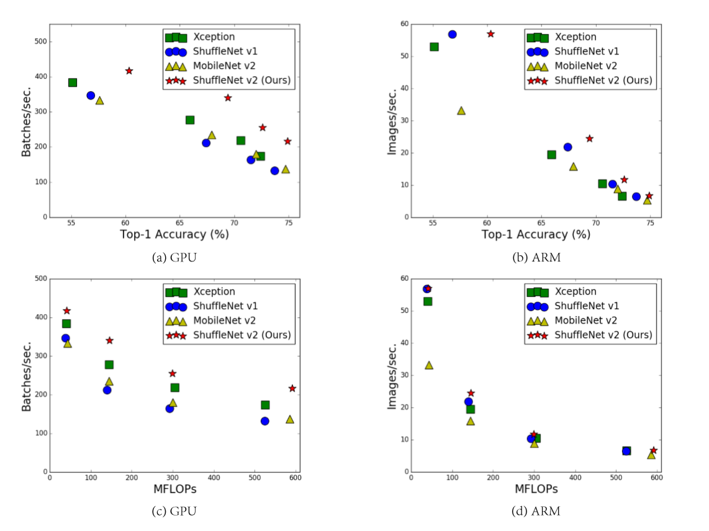

原文：[ShuffleNet V2: Practical Guidelines for Ecient CNN Architecture Design](http://xxx.itp.ac.cn/pdf/1807.11164.pdf)

### 模型性能指标

​	绝大多数的模型压缩和加速的文章中都使用FLOPs(float-point operations)作为模型的评价指标,用来衡量卷积计算量。但是本文开始就通过一组对比试验指出即使是相同MFOPs的模型，在不同平台上实际的处理速度仍差别很大。