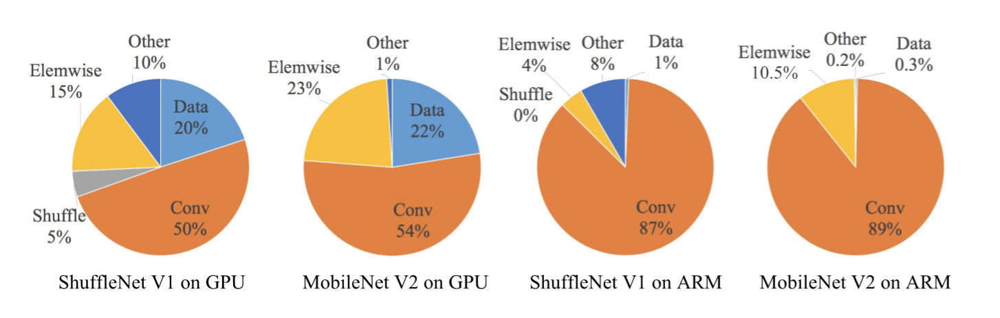
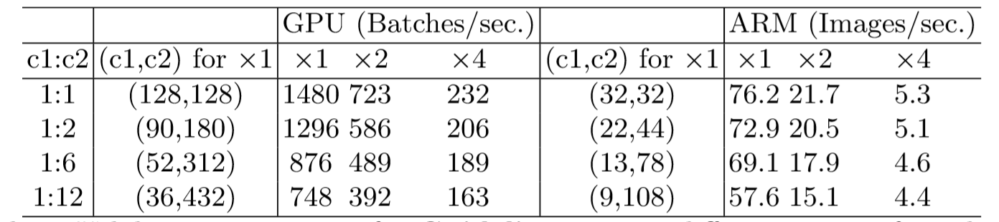

原文：[ShuffleNet V2: Practical Guidelines for Ecient CNN Architecture Design](http://xxx.itp.ac.cn/pdf/1807.11164.pdf)

### 模型性能指标

​	绝大多数的模型压缩和加速的文章中都使用FLOPs(float-point operations)作为模型的评价指标,用来衡量卷积计算量。但是本文开始就通过一组对比试验指出即使是相同MFOPs的模型，在不同平台上实际的处理速度仍差别很大。

文中分析了相同FLOPs时造成模型速度差别的原因：

- 有很多影响速度的因素FLOPs指标没能包含，比如并行程度和MAC。例如对于分组卷积，在算力强的平台上MAC会成为运算性能的瓶颈。
- 相同FLOPs时在不同平台上进行操作也会有不同的时间。CUDNN针对3*3的卷积进行了优化，所以速度上不是\(1*1\)卷积的9倍

接着指出评价网络的效率时：

- 使用更直接的指标，比如上文测试的处理速度
- 评价指标时需要针对具体平台进行测试

### 加速网络的四点指导

文中通过实验体现模型的运行时间的主要组成中，不仅仅是FLOPs体现的卷积运算量(卷积运算是主要部分)，也有很多数据有关的I/O操作或者element-wise的操作(ReLU,AddTensor)等。

#### G1：输入输出通道相同时MAC最小

$$
MAC=hw(c_{1}+c_{2})+c_{1}c_{2}
$$

在FLOPs一定时，也即\(B=hwc_{1}c_{2}\)一定，对MAC使用均值不等式，进行简单的变换带入B便可得到
$$
MAC \geq 2\sqrt{hwB}+\frac{B}{hw}
$$
等号成立时\(c_{1}==c_{2}\)得到$1*1$卷积操作输入输出通道数相同时$MAC$s最少

#### G2：

#### G3：

#### G4：